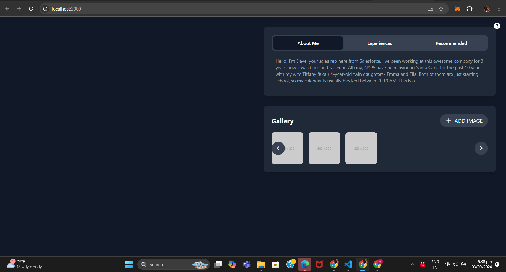

# Profile Dashboard
## Project Overview

The Profile Dashboard is a responsive web application designed for laptop screens (768px and above). It features two main interactive components: a tabbed widget for displaying information ("About Me," "Experiences," and "Recommended") and a gallery widget with the ability to add images. The project focuses on creating a clean, responsive layout while accurately replicating specific UI details, such as padding, margins, shadows, and interactivity.

### Technologies Used

### `React-js`:  A  JavaScript library for building user interfaces.
### `Tailwind CSS`: A utility-first CSS framework for quickly building custom designs.
### `Headless UI`:  Accessible UI components for React, including the Tab component.
### `Heroicons`: A set of free, MIT-licensed high-quality SVG icons.

# Features
1) Responsive Layout: Designed to work seamlessly on laptop screens (768px and above).
2) Tabbed Widget: A widget with three clickable tabs ("About Me," "Experiences," and "Recommended"), each displaying different content.
3) Gallery Widget: An interactive gallery with a button to add new images. Users can scroll through images using left and right navigation buttons.
4) Accurate UI Details: The project emphasizes replicating the exact UI details, including padding, margins, shadows, and interactivity.

# Screenshot 
